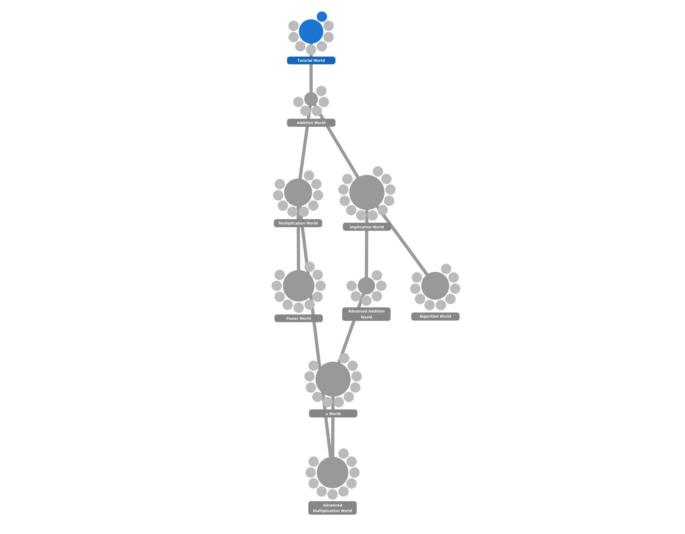

# Natural Number Game

Solving [the Natural Number Game](https://adam.math.hhu.de/#/g/leanprover-community/nng4) within the *ADAM: Anticipating the Digital Age of Mathematics* project at Heinrich-Heine-Universität Düsseldorf. I originally played this game on the `Lean3` version. Luckily, there now exists a `Lean4` version.

## Natural Number Game Levels

1. Tutorial World
2. Addition World
3. Multiplication World
4. Implication World
5. Power World
6. Advanced Addition World
7. Algorithm World
8. $\leq$ World
9. Advanced Multiplication World